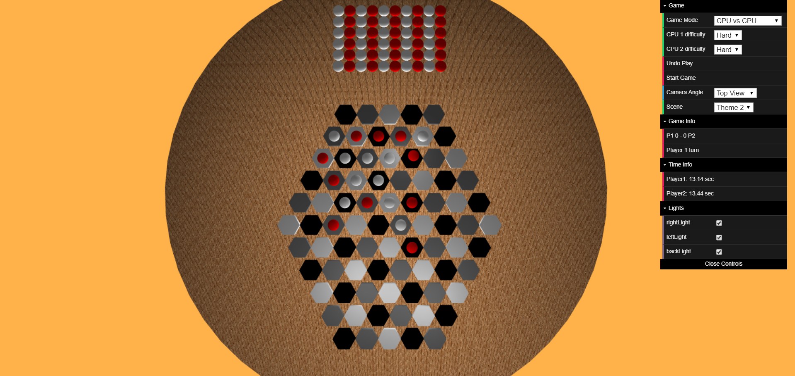
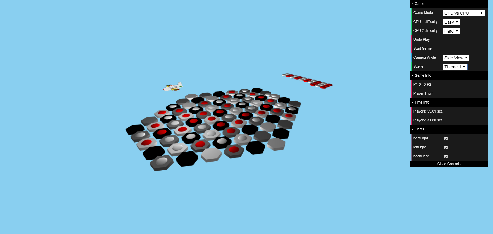

# FEUP_LAIG
Repository for the course "Laboratório de Aplicações com Interface Gráfica" (EIC0084) of the first semester of the third year of MIEIC in FEUP.

In this repository there is only the final project of the lective year 2017/2018 which has all the functionalities of the previous 2.

This is a JavaScript-based course in which students are expected to learn how to create 3D environments using the services provided by the operating system, especially on the areas of communication and synchronization. 

Students are proposed a project with a theme of their own choosing and, with the external library [WebCGF](https://paginas.fe.up.pt/~ruirodrig/pub/sw/webcgf/docs/) developed by a group of teachers from FEUP, they are expected to make an enviornment using primitives, different kinds of animations, shaders, etc.

The group started out by making an airport with an airplane and a hangar, later giving the plane an animation as well as using shaders on some parts of the environment.

On the 3rd iteration of the project, its aim changed to the integration of a board game (developed over the course [PLOG](https://github.com/MarioFernandes73/FEUP_PLOG) ) on the existing environment. The game was represented using javascript and all calculations of possible moves, cpu moves etc. were made on a server-like PROLOG program. The communication was made using Http Requests.

The game chosen was "Boku" which is a "5-in-a-row"-like game with an hexagonal board.

Fig1 - Top view & Theme 2 gameplay

Fig2 - Side view & Theme 1 gameplay

Credits:
* [Mário Fernandes](https://github.com/MarioFernandes73)
* [Nelson Almeida](https://github.com/PoiSoNz)
